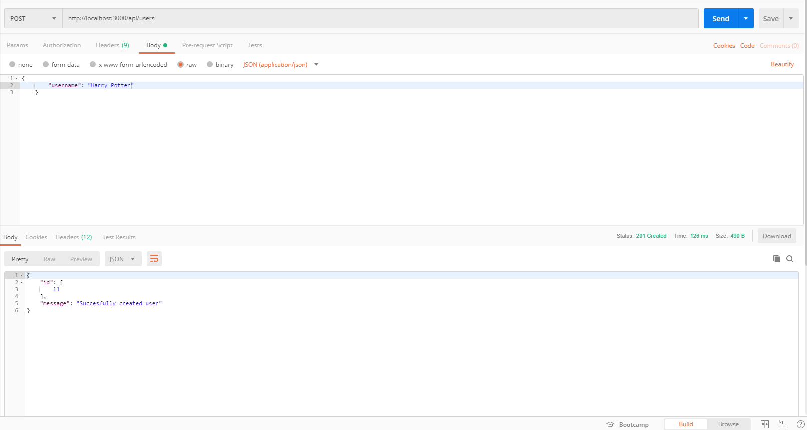
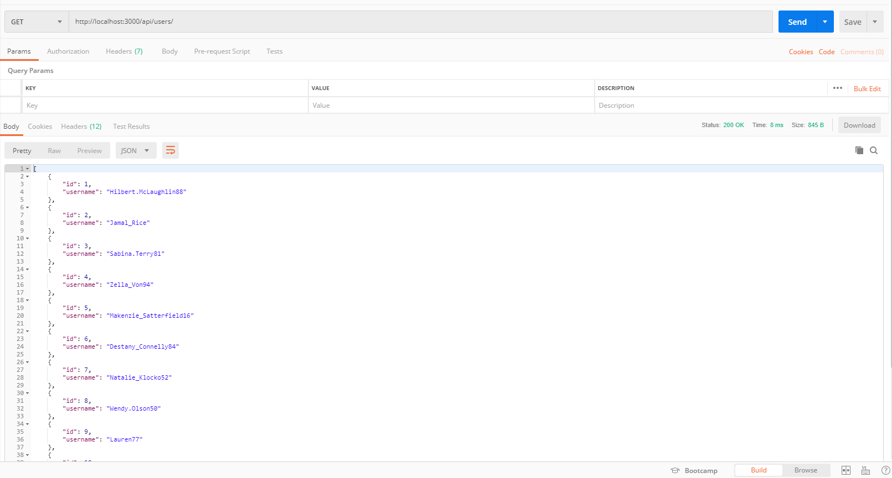
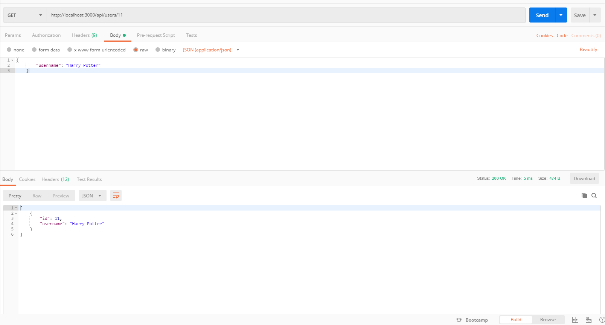
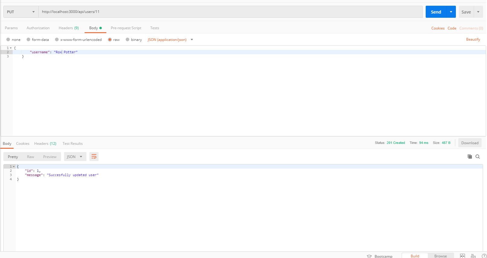
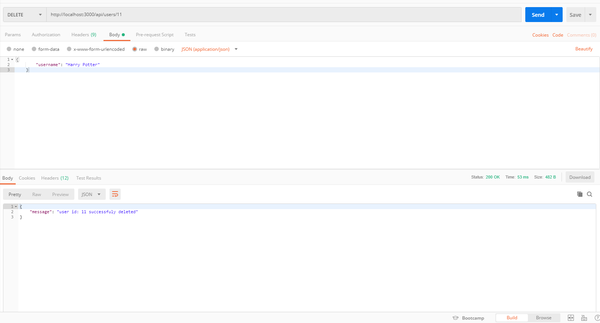

# neral Server

This is a REST CRUD API with endpoints to create, read, edit and update data in a database.

## RUNNING API

The API can be run in a few different ways the simplest to get it up and running in a fast fasion is to run the server locally. for this you can fork and / clone it to your local machine.

**There are some prerequisites for this however:**

- [git](https://www.linode.com/docs/development/version-control/how-to-install-git-on-linux-mac-and-windows/)
- [nodejs](https://nodejs.org/en/download/)
- [npm](https://docs.npmjs.com/getting-started/installing-node)
- [yarn](https://yarnpkg.com/lang/en/docs/install/#windows-stable) (optional but reccommended)

FORK
`to fork see the link below`
[how to fork](https://help.github.com/articles/fork-a-repo/)

CLONE
`git clone git@github.com:labsce1-social-app/neral.git`
this will clone the repository locally to your machine.

SETUP
`cd neral`
`yarn`
this will move you in to the project directory then using yarn you will download and install the dependencies.

RUN
`yarn server`
This will run the development server at `http://localhost:3000/` using nodemon
you can use `yarn start` to run it with node. **for usage see the endpoints**

---

## USAGE

**CRUD OPERATION ENDPOINTS**
The endpoints link you to the functionality of the database and include:

- `C`reate - `POST` endpoint to do `INSERT` on the database
- `R`ead - `GET` endpoint to do `GET` on the database
- `U`pdate - `PUT` endpoint to do `UPDATE` on the database
- `D`elete - `DELETE` endpoint to do `DELETE` on the database

### USERSROUTES

#### CREATE

**create a user**

URI: `http://<server_address:port>`

ENDPOINT: `POST -> /api/users`

URL: `URI/ENDPOINT`

this endpoint takes in a json object as the body of the request that must contain a username (max 25 characters), and an id (automatically generated) :

```
{
  "id": "1",
  "username": "some content"
}
```



### READ

**get a list of all users**

URI: `http://<server_address:port>`

ENDPOINT: `GET -> /api/users`

URL: `URI/ENDPOINT`



**read a single users by id**
`GET -> /api/users/:id`



### UPDATE

**update a user by id**

URI: `http://<server_address:port>`

ENDPOINT: `PUT -> /api/users/:id`

URL: `URI/ENDPOINT`


this endpoint takes in a json object as the body of the request that must contain a username :

```
{
  "username": "some content"
}
```



### DELETE

**delete a user by id**

URI: `http://<server_address:port>`

ENDPOINT: `DELETE -> /api/users/:id`

URL: `URI/ENDPOINT`




